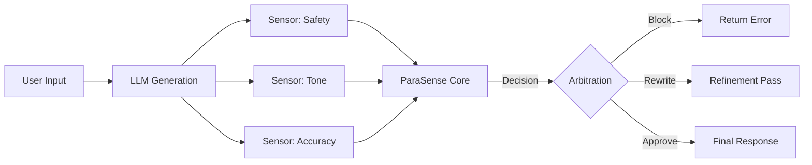

# Case Study: LLM Guardrails & Hallucination Control 🤖

## The Engineering Challenge

LLMs (like GPT-4 or Claude) are powerful but non-deterministic. In enterprise environments, relying solely on prompt engineering ("You are a helpful assistant...") is insufficient for safety critical applications.

**The Conflict:**
- **Directive A:** "Answer the user's question helpfuly." (Drive for utility)
- **Directive B:** "Do not reveal internal financial data." (Drive for safety)
- **Directive C:** "Maintain a professional tone."

When a user employs "jailbreak" techniques or subtle social engineering, these directives conflict. A probabilistic model might hallucinate compliance.

## The ParaSense Solution (Symbolic Arbitration)

Instead of asking the LLM to police itself, we wrap the interaction in a **ParaSense Decision Mesh**.

### 1. Evidence Extraction (The Sensors)
We use smaller, specialized NLP models (Classifiers) to act as sensors. Each sensor produces a tuple `(μ, λ)`:
- **Sensor 1 (PII Detector):** Detects personal info.
- **Sensor 2 (Tone Analyzer):** Detects aggression/informality.
- **Sensor 3 (Relativity Check):** Checks if answer is on-topic.

### 2. The Lattice Decision
These signals are fed into the ParaSense Engine. 

*Scenario:* User asks a valid financial question but uses slightly aggressive language.

- **Utility Sensor:** μ=0.9, λ=0.0 (Valid question)
- **Tone Sensor:** μ=0.2, λ=0.8 (Aggressive tone)
- **Risk Sensor:** μ=0.1, λ=0.0 (Low security risk)

**Result:** The system enters a `Para-Consistent` state. Instead of blocking (False Positive) or allowing (False Negative), the engine detects the specific nature of the conflict (Valid Request vs Bad Tone).

### 3. Arbitrated Action
The engine executes a predetermined strategy for this logical state:
> *"Rewrite the response to be polite, but answer the question."*

This is **Deterministic Control** over **Stochastic AI**.

## Architecture

