# Estudo de Caso: LLM Guardrails & Controle de Alucinação 🤖

## O Desafio de Engenharia

LLMs (como GPT-4 ou Claude) são poderosos, mas não determinísticos. Em ambientes corporativos, depender apenas de *prompt engineering* ("Você é um assistente prestativo...") é insuficiente para aplicações de missão crítica.

**O Conflito:**
- **Diretiva A:** "Responda à pergunta do usuário de forma útil." (Foco em utilidade)
- **Diretiva B:** "Não revele dados financeiros internos." (Foco em segurança)
- **Diretiva C:** "Mantenha um tom profissional."

Quando um usuário utiliza técnicas de "jailbreak" ou engenharia social sutil, essas diretivas entram em conflito. Um modelo puramente probabilístico pode alucinar conformidade.

## A Solução ParaSense (Arbitragem Simbólica)

Em vez de pedir para o LLM se policiar, envolvemos a interação em uma **Malha de Decisão ParaSense**.

### 1. Extração de Evidências (Os Sensores)
Usamos modelos de NLP menores e especializados (Classificadores/BERT) para atuar como sensores. Cada sensor produz uma tupla `(μ, λ)`:
- **Sensor 1 (Detector de PII):** Detecta informações pessoais.
- **Sensor 2 (Analisador de Tom):** Detecta agressividade/informalidade.
- **Sensor 3 (Checagem de Tópico):** Verifica se a resposta está dentro do escopo.

### 2. A Decisão no Reticulado
Esses sinais alimentam o Motor ParaSense.

*Cenário:* Usuário faz uma pergunta financeira válida, mas usa linguagem levemente agressiva.

- **Sensor de Utilidade:** μ=0.9, λ=0.0 (Pergunta válida)
- **Sensor de Tom:** μ=0.2, λ=0.8 (Tom agressivo)
- **Sensor de Risco:** μ=0.1, λ=0.0 (Baixo risco de segurança)

**Resultado:** O sistema entra em um estado `Para-Consistente`. Em vez de bloquear (Falso Positivo) ou permitir (Falso Negativo), o motor detecta a **natureza específica do conflito** (Pedido Válido vs Tom Ruim).

### 3. Ação Arbitrada
O motor executa uma estratégia predeterminada para este estado lógico:
> *"Reescrever a resposta para ser polida, mas responder à pergunta técnica."*

Isto é **Controle Determinístico** sobre **IA Estocástica**.

## Arquitetura

```mermaid
graph LR
    User[Input Usuário] --> LLM[Geração LLM]
    LLM --> S1[Sensor: Segurança]
    LLM --> S2[Sensor: Tom]
    LLM --> S3[Sensor: Precisão]
    S1 --> Engine[Núcleo ParaSense]
    S2 --> Engine
    S3 --> Engine
    Engine -->|Decisão| Action{Arbitragem}
    Action -->|Bloquear| Error[Retornar Erro]
    Action -->|Reescrever| LLM2[Passada de Refinamento]
    Action -->|Aprovar| Output[Resposta Final]
```

